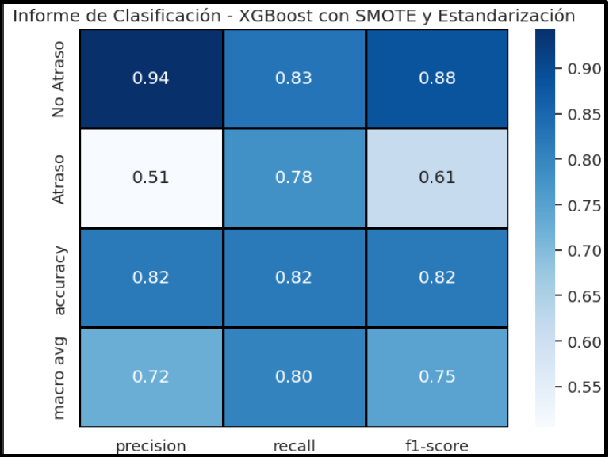
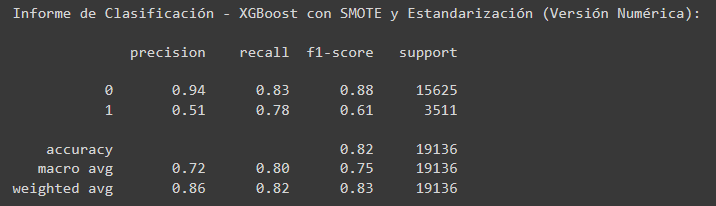
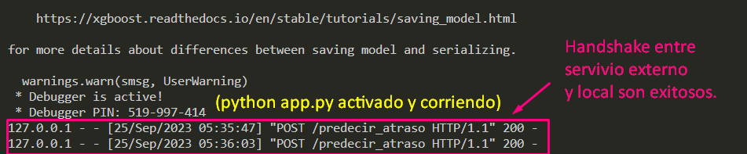
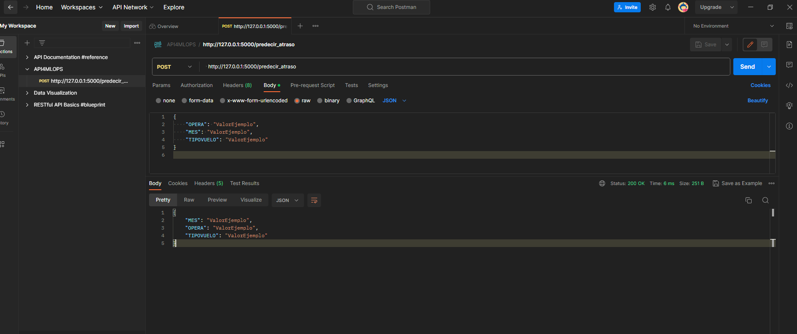

# NW4daysChallenge_AtrasoVuelos

# **Análisis del proyecto de Juan sobre Predicción de Atrasos en Vuelos**


Este proyecto se centra en la evaluación y mejora de un modelo de predicción de atrasos de vuelos y su implementación en una interfaz de usuario, con el objetivo de poner a prueba su eficiencia mediante una API REST y un test de estrés.

**Introducción:**
Durante el desarrollo de este proyecto, se llevaron a cabo diversas tareas de análisis de datos y modelado con el objetivo de predecir atrasos en vuelos. Se exploraron los datos iniciales y se aplicaron varias técnicas de procesamiento, incluyendo la construcción de nuevos atributos y la estandarización de los datos. Además, se probaron varios modelos de aprendizaje automático, se ajustaron hiperparámetros y se evaluaron sus resultados. Este es un notebook de investigación basado en lo creado por Juan y budcó expandir ciertos aproaches que Juan n cubrió, en especial, implementar técnicas distintas en los modelos utilzados e intepretaciones especificas, se detalla el proceso seguido y se presentan los resultados obtenidos. A modo de guía se sugiere focalizar el Notebook en 3 fases. 

* La primera: exploratoria con modificaciones en los datos y exposición gráfica simple como tablas informativa unicamente.

* la seguna modificación y preparación de los datos (imputación, eliminación, técnicas de regularizacion, encoding, PCA ,etc) 

* y la ultima, probar distintas estratégias con modelos que adhieren mejor aun analisis de clasificación predictorio de caracter preliminar binario como Atraso/no atraso.

**Exploración de Datos:**
Se inició el proyecto realizando una exploración de los datos, identificando características clave y tendencias. Se observó que los datos presentaban desafíos, como el desequilibrio entre las clases de atraso, exceso/ausencia de datos para algunosatributos como algunos destinos y la necesidad de manejar atributos categóricos como dificultad general.

**Preprocesamiento de Datos:**
Para abordar los desafíos, se realizaron los siguientes pasos:

1. **Reconstrucción de Datos:** Se reconstruyeron los datos previamente procesados, mejorando la selección de columnas y descartando aquellas que no eran relevantes.

2. **Construcción de Nuevos Atributos:** Se validó la creación de atributos como "dif_min," que refleja la diferencia máxima entre los tiempos de vuelo planificados y operados, y "atraso_15," un indicador binario de atrasos mayores a 15 minutos. son un buen proxy para el alcance preliminar del proyecto.

3. **One-Hot Encoding:** Para manejar atributos categóricos, se aplicó la técnica de one-hot encoding.

4. **Eliminación de Datos No Relevantes:** Se eliminaron filas con valores alfanuméricos en características específicas, ya que representaban un pequeño porcentaje del conjunto de datos. (Feature: Vlo-I/Vlo-O | 0.02% erased).

**Modelado:**
Se probaron varios modelos de aprendizaje automático, incluyendo Regresión Logística, SVM, y XGBoost. Se realizaron ajustes de hiperparámetros y se aplicaron técnicas de regularización como Lasso y Ridge junto a tunning se sus distintas estratégias para optimizar timepo de procesamiento y resultado esperado. Además, se utilizó la técnica de sobremuestreo SMOTE para abordar el desequilibrio de clases.

**Resultados:**
El modelo final de XGBoost con SMOTE y estandarización mostró mejoras significativas en términos de precisión y recall en comparación con los modelos anteriores. El F1-score balanceado indicó un equilibrio razonable entre precision y recall. La precisión general del modelo fue del 82%, aunque la precisión para la clasificación de "Atraso" sigue siendo un área de mejora pero un recall de un 0.78 es un buen paso en la dirección correcta.




**Próximos Pasos del modelo y sus dependencias**

El proyecto se encuentra en una etapa avanzada, y se espera que se completen las tareas pendientes para lograr una solución funcional y eficiente. La implementación de la API REST y la prueba de estrés son muchisimo mas sencillas de implementar y resolver que mejorar la precisión y fitness de un modelo o búsqueda de mejores datos, feature engineering, etc. Por lo que me gustaría completar este proceso y ver como optimizarlo y automatizarlo. Creo que son pasos cruciales para demostrar la capacidad del modelo en un entorno real.

### Desafíos Enfrentados con el modelo

- **Sobreajuste (Overfitting):** Inicialmente, el modelo tenía problemas de sobreajuste, lo que requería ajustes adicionales.

- **Desbalance de Datos:** Los datos presentaban un desbalance entre vuelos a tiempo y con atrasos, lo que afectó la calidad del modelo.

- **Limitaciones de Recursos:** Restricciones de hardware y tiempo de procesamiento limitaron la optimización de hiperparámetros y modelos. Mas tiempo o mas recursos hubieran mejorado este resultado.

*(el Jupyter Notebook contiene anotaciones y observaciones mucho mas detalladas sobre el desarrollo, alcances y limitantes de este analisis. ver en `Challenge_NW_MLE_MLOPS_Atraso_vuelos_v2.ipynb`)*


## Interfaz de Usuario

Se creó una interfaz de usuario simple en `front.html`, que en teoría permite a los usuarios ingresar información relevante para la predicción, como el operador de vuelo y el mes. Esta interfaz debía de actuar como el punto de entrada para interactuar con el modelo. en `frontv2.html` construí uno mas avanxzado que budsca hacer lo mismo pero este es un ejemplo de la interfaz de usuario que utilizará mi modelo y cómo los usuarios pueden interactuar con él. Mi idea es que lso usuasrios interactuen seleccionando lso operadores, mes de vuelo, tipo de vvuelo y sigla destino para que el modelo pueda devolverles una idea general de como se comportaría su viaje, con posibilidad de retraso o no y su probabilidad numerica.
Lo ideal sería poder quizas insertar los atributos de ['OPERA', 'MES', 'TIPOVUELO', 'SIGLADES', 'DIANOM','temporada_alta', 'dif_min', 'periodo_dia'] con nombres mas claros para interacción con el usuario. Algunos pueden ser redundantes (como temprada_alta y MES ya que uno puede describir al otro), pero esto depende de la decisión final de negocio.

### Pendientes y Pasos Sugeridos

A pesar de los avances, aún quedan tareas por completar para alcanzar la meta final:

1. **Implementación de API REST:** El modelo se exportó y serializó en formato .pkl. Sin embargo, persisten problemas técnicos al intentar conectar el modelo a una API REST. Las pruebas en un entorno local (mi notebook) se han realizado, pero la falta de acceso desde el navegador (distintos fueron probados) podría estar relacionada con limitaciones propias de mi notebook. Una limitación imprevista. Es posible que se requieran configuraciones en dispositivos preparados para este tipo de procesos más avanzados. Si yo dispusiera de un dispositivo más moderno, se esperaría una implementación exitosa de la API REST. Creé un mockup del README.md de como podria ser el archivo para que un usuario ejecute el proyecto ya en modo funcional. este quedó guardado como InfoReadme.md.


2. **Prueba de Estrés (Stress Test):** Se avanzó en inicializar las herramientas de prueba de estrés utilizando herramientas como [wrk](https://github.com/wg/wrk) para evaluar el rendimiento del sistema bajo una alta carga, con el objetivo de procesar eficientemente al menos 50,000 solicitudes en 45 segundos. Monté el request en un Postman https://web.postman.co/  para forzar los requests pero sin acceso desde mi computador al puerto  'http://127.0.0.1:5000/predecir_atraso' que diseñé en la app.py por lo que no se logra aun hacer la validación del funcionamiento del modelo en local. 

Si se logró hacer un "handshake" entre Postman y mi servidor local desde el software en linea usando  http://127.0.0.1:5000/predecir_atraso con un breve codigo el cual retornó exitosamente.



 

Esto nos indica que la configuración posterior necesaria para las pruebas de restfull API y capacidad de carga del modelo en Cloud está algunos pasos mas adelante nomas. Sería genial extender mas esta investigación con soporte de algun colega mas Senior en diseño de Redes y Sistemas Infraestructura a este nivel para verificar su correcto funcionamiento pero, so far, logramos operar con éxito hasta esta instancia. 

3. **Despliegue en la Nube:** Idealmente, se consideraría desplegar la aplicación en una plataforma en la nube para garantizar su disponibilidad y escalabilidad. En lo personal, puedo manejar SageMaker, Elastic (de AWS) y he desarrollado pruebas de concepto con Azure web pero me limitan los costos para probar la eficiencia del modelo una ves montado y no dispongo de credito para ejecutar tales cloud deployment. Tambien cuento con un proyecto End to End e MLFlow que da muestra de mejor diseño del sistema de carpetas (que pseudo-ilustré con mi Generador_Template.py) creando el entorno de folders fudacional para que un modelo persista, uso de scripts para reconstruir automatizadamente los requerimientos del modelo que se esté construyendo y desplegando , CI/CDI con su Pipeline, config.yaml, params.yaml (check de parametros correctos de las features previo validación) e input / output para los productos generados siendo guardados en folders como Constants, Components y Artifacts. Espero mejorarlo para exponerlo en breve.


**Conclusión:**
En resumen, este proyecto involucró un proceso completo de exploración, preprocesamiento y modelado de datos para predecir atrasos en vuelos. Hubo varios cambios de dirección en su desarrollo, como la prueba con otros modelos que no se adjuntaron por entregar nulo valor analítico. pero sirvió como referencia y descarte del tipo de objetivo del analisis y el tipo de variables en juego. Si bien con XGboost se lograron mejoras notables en la precisión y el recall luego de realizar multiples combinaciones de otras técnicas y 'tuneo', todavía existen oportunidades para ajustes adicionales y mejoras en la detección de atrasos. Como ejercicio y 'maqueteo', el proyecto representa un avance significativo en la dirección correcta y sienta las bases para futuros desarrollos y refinamientos, claro está, una ves se seleccione un dataset definitivo optimo y balanceado y un objetivo conciso a explorar bajo los algoritmos preliminares.

**Librerías Claves Utilizadas:**
- Pandas
- Scikit-learn
- XGBoost
- Imbalanced-learn (SMOTE)
- Matplotlib
- Seaborn

**Duración del Proyecto:**
El proyecto se realizó en un total de aproximadamente 8-9 horas distribuidas en varias sesiones de trabajo a lo largo de 4 días efectivos.

## WORKFLOW:

* instalar IDE/herramientas de preferencia (VSCode, Pycharm, etc)
    * PyCharm    - https://www.jetbrains.com/es-es/pycharm/
    * VSCode (studio) - https://code.visualstudio.com/
    * Anaconda navigator - https://docs.anaconda.com/free/navigator/index.html
    * Postman (optional) - https://www.postman.com/
    * Git BASH (optional) - https://git-scm.com/downloads

* clonar git
* Activar Entorno (env)
* ejecutar `Generador_Template.py`
* Dependencias `requirements.txt`
### Clonemos el repository

```bash
https://github.com/Kokit0/NW4daysChallenge_AtrasoVuelos.git
```
### Crea el entorno (Conda o custom) luego de abrir y cargar el repositorio.

#### en terminal VSCode (o tu Git BASH en la carpeta donde descargues el proyecto)
```bash
python -m venv NWMLEMLOPSenv
```
#### Recuerda activar tu entorno.
```bash
NWMLEMLOPSenv/Scripts/activate
```
### Instalar dependencias
Estas son dependencias basales para correr el modelo desde un repositorio con su propio sistema de folder y files mas desarrollado. Sugiero antes e generar las carpetas y otros, para ver el modelo en ejecución en modo prueba, lo mas simple es activar pimero un entorno python y verlo directamente en el '.ipynb' https://github.com/Kokit0/NW4daysChallenge_AtrasoVuelos/blob/main/notebooks/Challenge_NW_MLE_MLOPS_Atraso_vuelos_v2.ipynb

```
pip install -r .\requirements.txt
```
### Ejecutar generador_Templado.py (si deseas una instancia limpia custom)
Este templado es una herramienta quer cree para generar el sistema decarpetas inicial sobre el cual se puede iterar en el mismo repositorio copiado en su propia IDE. Es solamente un headstart y permite comenzar a organisar el repositorio para mayores systematizaciones. En otro ptroyecto qu estoy desarrollando en paralelo a este (https://github.com/Kokit0/End-to-End-MLP-with-MLFlow), he creado un end to end con MLFlow que explora mucho mas a fondo la generación de estos templados de kickstart. por ahora lo usaré como prueba de concepto básica funcional.

```python
python Generador_Template.py  
```

### Actualizar dataset segun predilección. En nuestro caso utilizaremos 'dataset_SCL.csv' como el dataset sin limpieza. el Notebook genera un dataset "limpio" con el cual luego se entrenaría el modelo. Para recrear dersde cero: utilizar `dataset_SCL.csv`.
https://github.com/Kokit0/NW4daysChallenge_AtrasoVuelos/raw/main/data/dataset_SCL.csv

### Ejecutemos la app Flask (app.py)

```python
python app.py
```

________________________________________________________________
## otros no relevantes pero parte del proceso de exploración y construcción de este Repositorio

* Construí algunos archivos intermediarios que me sirvieron para verificar funcionalidades a lo alrgo del proceso, desde versiones de calling (handshake entre servidor e instancia local) para Postman `HandShakeTestapp.py`. Este simplemente al ser montado, genera un calculo gausseano lo que prueba que el poder de calculo es viable desde esta plataforma y la comunicación + computación en nuestra "caja negra" estan ocurriendo exitosamente. 

* Lo mismo con los `frontv1.html` que no son de utilidad en el esquema del sistema de archivos de este repositorio pero si paso intermedio para el desarrollo del diseño inicial del .html para la pagina que con la que el usuario podría interactuar. 

* además, está `Research_notebook01.ipynb` que es un placeholder que genero automaticamente con mi `Generador_Templado.py`. Este notebook es el automático generado sobre el que fui trabajando el modelo final. No tiene contenido y solo lo dejo en el repositorio como evidencia de su potencial al automatizar la creación de los file types necesarios para construir un folder system para un modelo de persistencia.

* **Version Control** Por último, se decidió no realizar control de versiones estrictos, ya que todo el desarrollo inicial consistió en diseñar el Jupyter Notebook, explorar el objetivo del desafío y luego redactar el generador templado que luego se pobló directamente con los archivos. Se realizaron comandos de `commits y push` de todos los archivos a medida que fueron realizados, pero no se requirió de branching debido a que se trató de ejecuciones en frío sin necesidad de paralelizar labores con control de versiones. En `InfoReadme.md` dejo información de contacto y minimas instrucciones de run del repositorio funcional como mockup.


________________________________________________________________

## Licencia

Este proyecto está bajo la licencia [Licencia MIT]. Puedes consultar el archivo [LICENSE.md] para obtener más detalles.
